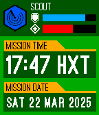
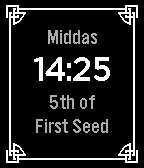
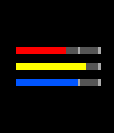
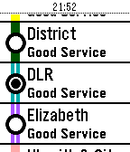

# pebble-dev

Repository with my Pebble watchfaces, watchapps, and libraries - old and new.
Working status is shown in the lists below.

Some PBWs can be found in `/pbw` for sideloading.

- [watchfaces](#watchfaces)
- [watchapps](#watchapps)
- [libraries](#libraries)
- [other](#other)
- [Other repositories](#other-repositories)
- [Debugging](#debugging)

## `watchfaces`

> Platforms: `A` = Aplite, `B` = Basalt, `C` = Chalk, `D` = Diorite, `E` = Emery

| Name                           | Screenshot                                                                    | Builds              | Icon | PBW                                |
|--------------------------------|-------------------------------------------------------------------------------|---------------------|------|------------------------------------|
| `brackets`                     |                                | `A` `B` `C` `D`     | ✅    | [pbw](pbw/brackets.pbw)            |
| `cards`                        |                                  | `A` `B` `D`         |      | [pbw](pbw/cards.pbw)               |
| `cmd-time-typed`               |                         | `A` `B` `C` `D` `E` | ✅    | [pbw](pbw/cmd-time-typed.pbw)      |
| `cmd-time`                     |                               | `A` `B` `C` `D` `E` | ✅    | [pbw](pbw/cmd-time.pbw)            |
| `dayring`                      |                                 | `A` `B` `C` `D`     |      | [pbw](pbw/dayring.pbw)             |
| `deep-rock`                    |                               | `A` `B` `D`         |      | [pbw](pbw/deep-rock.pbw)           |
| `dual-gauge`                   |                              | `A` `B` `C` `D`     |      | [pbw](pbw/dual-gauge.pbw)          |
| `eclipse`                      |  | `A` `B` `D`         |      | [pbw](pbw/eclipse.pbw)             |
| `events`                       |                                  | `A` `B` `D` `E`     | ✅    | [pbw](pbw/events.pbw)              |
| `hollywatch`                   |                              | `A` `B` `C` `D`     |      | [pbw](pbw/hollywatch.pbw)          |
| `index`                        |                                   | `A` `B` `C` `D`     |      | [pbw](pbw/index.pbw)               |
| `isotime-appstore`             |                        | `A` `B` `C` `D` `E` | ✅    | [pbw](pbw/isotime.pbw)             |
| `kitty-watchface`              |                         | `A` `B` `D`         |      | [pbw](pbw/kitty-watchface.pbw)     |
| `morndas`                      |                                 | `A` `B` `D`         |      | [pbw](pbw/morndas.pbw)             |
| `past-present-future`          |                     | `A` `B` `D`         |      | [pbw](pbw/past-present-future.pbw) |
| `pseudotime`                   |                              | `A` `B` `C` `D`     |      | [pbw](pbw/pseudotime.pbw)          |
| `split-horizon-pe`             |                       | `A` `B` `D`         | ✅    | [pbw](pbw/split-horizon-pe.pbw)    |
| `starfield-demo`               |                          | `A` `B` `C` `D`     |      | [pbw](pbw/starfield-demo.pbw)      |
| `starfield-smooth`             |                        | `A` `B` `C`         | ✅    | [pbw](pbw/starfield-smooth.pbw)    |
| `time-dots-appstore`           |                     | `A` `B` `C` `D`     |      | [pbw](pbw/time-dots-appstore.pbw)  |
| `split-horizon-se`             |                                                                               | ⚠️ (old inv layer)  | ✅    |                                    |
| `eclipse-solar`                |                                                                               | ❌ (WIP)             |      |                                    |
| `split-horizon-me`             |                                                                               | ❌ (old inv layer)   | ✅    |                                    |
| `divider-large-2`              |                                                                               | ❔                   | ✅    |                                    |
| `divider-small-2`              |                                                                               | ❔                   | ✅    |                                    |
| `eventful`                     |                                                                               | ❔                   |      |                                    |
| `past-present-future-extended` |                                                                               | ❔                   |      |                                    |
| `seven-segments-date`          |                                                                               | ❔                   | ✅    |                                    |
| `seven-segments`               |                                                                               | ❔                   | ✅    |                                    |

## `watchapps`

| Name             | Screenshot                                           | Builds                | Icon | PBW                           |
|------------------|------------------------------------------------------|-----------------------|------|-------------------------------|
| `block-world`    |     | `B` `C`               |      | [pbw](pbw/block-world.pbw)    |
| `news-headlines` |  | `A` `B` `C` `D`       | ✅    | [pbw](pbw/news-headlines.pbw) |
| `pge-examples`   |                                                      | ❌ (needs pge package) |      |                               |
| `tube-status`    |     | `A` `B` `C` `D`       | ✅    | [pbw](pbw/tube-status.pbw)    |

## `libraries`

| Name                      | Status | Test App |
|---------------------------|--------|----------|
| `InverterLayerCompat`     | ✅      | ✅        |
| `notif-layer`             | ✅      | ✅        |
| `pebble-isometric`        | ✅      | ✅        |
| `pebble-packet`           | ✅      | ✅        |
| `pebble-pge-simple`       |        |          |
| `pebble-simple-request`   |        |          |
| `pebble-timeline-js-node` |        |          |
| `pebble-timeline-js`      |        |          |
| `pebble-universal-fb`     | ✅      | ✅        |

## `other`

Defunct, incomplete, or PoC things live here.

## Other repositories

Some larger projects still live in their own repositories:

| Name                                                | Builds              | Icon | PBW                      |
|-----------------------------------------------------|---------------------|------|--------------------------|
| [thin](https://github.com/C-D-Lewis/thin)           | `A` `B` `C` `D` `E` | ✅    | [pbw](pbw/thin.pbw)      |
| [dashboard](https://github.com/C-D-Lewis/dashboard) | `A` `B` `C` `D`     | ✅    | [pbw](pbw/dashboard.pbw) |
| [beam-up](https://github.com/C-D-Lewis/beam-up)     | `A` `B` `C` `D`     | ✅    | [pbw](pbw/beam-up.pbw)   |
| [pge](https://github.com/C-D-Lewis/pge)             | -                   | -    | -                        |

## Debugging

Here are some errors encountered in old projects and the fixes I found:

#### `Missing node_modules directory`

Caused by invalid `name` in `package.json`.

Caused by `version` that was missing patch component.

#### `This project is very outdated, and cannot be handled by this SDK.`

Missing `wscript`. Running `pebble convert-project` helped.

#### `An invalid value of '2' was found in the 'sdkVersion' field of the project's package.json. The latest supported value for this field is '3'.`

(Even when it's not true) - manually update `appinfo.json` to the more recent
`package.json` format from another working project, field by field.

#### waf-looking errors or resource indice errors

Copy `wscript` from a working project.

#### Missing images

As of SDK 3, some image resource types like `png` were deprecated. `bitmap`
should be used instead

## Todo

- [x] Fix build in GitHub Actions
- [ ] Finish importing all previous Pebble projects
- [ ] Merge all Split Horizon editions into config.
- [ ] Menu icons for all current watchfaces and watchapps
- [ ] Migrate all custom config to Clay.
- [ ] Verify correct tick unit used.
