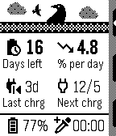
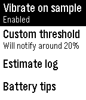
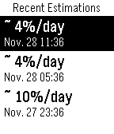

# muninn :zap: :bird:

_Odin tasked Muninn with memory of the land... Over time, he will provide you with battery wisdom._

<table>
  <tr>
    <td></td>
    <td></td>
    <td></td>
  </tr>
</table>

Muninn is an extremely lightweight battery estimation app that uses the
Wakeup API instead of the Background Worker to monitor battery discharging
trends and provide insight without negatively affecting battery life. It uses a
moving average of six-hourly readings over time to estimate remaining days of
battery life and rate of discharge.

Estimates will begin to appear after two of these readings have been taken.

Features include:

- Negligible battery impact.
- Moving-average estimation of remaining battery life, weighted towards recent values.
- Option to vibrate when a sample is taken.
- Option to advise when battery charge is below a chosen threshold (50%/20%/10%).
- Attempt to set AppGlance to show estimate in the launcher menu.
- Option to create a timeline pin at noon on the day the charge may run out.
- View detailed logs of recent estimates.
- View general battery tips and Muninn lore.
- Ability to disable temporarily.
- Completely delete and reset all app data.

Important notes:

Once installed it must be woken up, and if the watch is off at the next
six-hourly interval, the app must be launched to allow wakeups to be resumed.
If the first period is less than six hours, the initial estimate may be an
overestimate but will smooth out soon. Any missed wakeups will be ignored.

## Notes

- Can we use wakeup instead of background worker to track battery life?
- Can we do it without storing huge amounts of samples?
- Initial launch -> wakeup estimate will be on a shorter period of time
- Watches reporting 10% increments may overestimate?
- In scope: current level, remaining days, rate per day, moving average
- Out of scope: fancy graphs, using background worker

## Challenges:

- Detecting charging: charge level goes up or is constant
- Extremely short charge: use elapsed period instead
- Handling partial discharges: use calculated rate instead of all samples
- Handling changing demands/watchface etc: moving rate
- Zero change since last sample (<1% per hour) - ignore

## Bugs

Please report bugs including - watch model and age (i.e.: Pebble Time Steel, 
from 2016) and what kind of anomalous behavior you encountered.

## TODO:

- [x] Rolling window of N values for better average
- [x] App UI (summary > menu > state view)
- [x] Wakeup UI
- [x] Bird blinking
- [x] Disable confirmation (long press)
- [x] UI polish
- [x] Handle missing samples while off
- [x] Settings? Custom alert?
- [x] Real-world testing over several days
- [x] Test power-off picks up correctly
- [x] Test charging and resuming works
- [x] Attempt to set AppGlance
- [x] Pre-release: single app data structure
- [x] Emery screen size support
- [x] Some kind of color flair for color watches
- [x] Show log entries for wakeups where charging was observed
- [x] Push timeline pin for charging time prediction.
- [ ] Extremely simple chart using log timestamps? requires more stored samples (CHECK DATA LOADS OKAY)
- [ ] Export/import data log to/from JS
- [ ] Show more detailed data and charts on JS settings page?
- [ ] Use `pebble-packet` when `pebble-events` is updated with `flint`
- [ ] Use ContentSize API more
- [ ] Display status of timeline pin insert request in settings window.
- [ ] Chalk layouts
