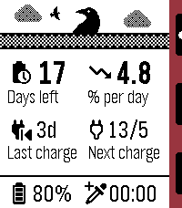
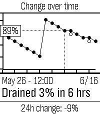
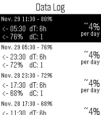
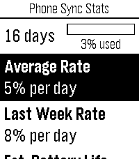

# muninn :zap: :bird:

_Odin tasked Muninn with memory of the land... Over time, he will provide you
with battery wisdom._

<table>
  <tr>
    <td></td>
    <td></td>
    <td></td>
    <td></td>
  </tr>
</table>

## Description

Muninn is an extremely lightweight battery tracking and prediction app. It uses the Wakeup API (every 6 hours) instead of the Background Worker to monitor trends and provide insight without negatively affecting battery life, using a moving average of readings over time to estimate days left, rate of discharge, next charge date, and more!

Features:
- Negligible battery impact
- Days remaining and drain rate estimation
- Last observed charge and predicted next charge date
- Graph log of recent samples, up to 4 days
- Sync up to 120 days of data to the phone for long-term insights
- Upload and view all your data in web config page
- Set an AppGlance to show estimate in the launcher menu
- View general battery tips

Options:
- Custom low battery threshold notification (50%/20%/10%)
- Timeline pin at noon on the last day remaining
- High (above average) rate of drain notification
- One day left notification
- Auto-update of web config page stats (noon daily)

Important notes:
- If the watch is off at the next sample time, the app must be launched to allow wakeups to be resumed.
- The initial estimate may be an overestimate but will smooth out soon after.

## Backend

The extended sample history saved in JS-side storage can be uploaded to the
backend, which assigns a 6-character short code for each watch token, and allows
viewing of all the data with charts and longer-term statistics. It's built with
TypeScript, Vite, and deployed with Terraform into AWS. See
[backend](./backend/) for more information.

## Bugs

Please report bugs here on in the
[Discord thread](https://discord.com/channels/221364737269694464/1444392721539403868)
including watch model and age (i.e.: Pebble Time Steel, from 2016) and what
kind of anomalous behavior you encountered.
