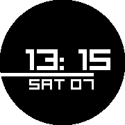
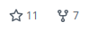

# beam-up

Minimal sharp-edged animated watchface for Pebble smartwatch.

## Features

* Every changed digit is 'beamed up'.

* 15-second interval animated indicator.

## Customisations

Using the 'Settings' button in the Pebble app after install, choose from the following variants:

* Pick colors

* Show short date

* Animations

* Show disconnected indicator

* Vibrate on the hour

## TODO

- Emery support

## History

GitHub stats prior to being moved to `pebble-dev`:

