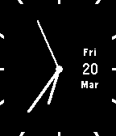
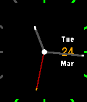
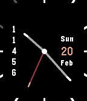
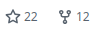

# thin

Simple, customizable Pebble watchface with splashes of color. 

Runs on all Pebble watches.

 

Use the config page (powered by [Clay](https://github.com/pebble/clay) to
adjust which features you want from the following:

- Show weekday/month
- Show day of the month
- Show dis/connected indicator
- Show battery level
- Show seconds hand
- Show step count

## History

GitHub stats prior to being moved to `pebble-dev`:

## TODO

- [ ] Support `flint` once `pebble-clay` does
- [ ] Custom colors!
